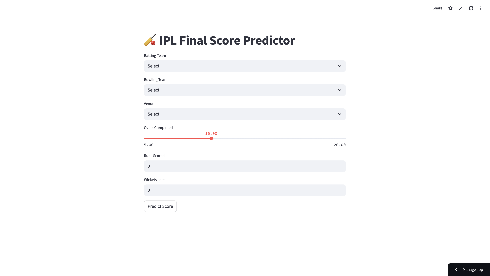

# 🏏 IPL Score Predictor

A machine learning-based Streamlit web app to predict the final score of an IPL innings using ball-by-ball match context, trained on detailed historical IPL data (2008–2025).

---

##  Project Highlights

- Uses match context like teams, venue, runs, wickets, and overs to predict final score.
-  Model: Trained using a Keras Sequential model with two hidden layers on ball-level IPL data.
-  Input features are scaled using `MinMaxScaler` and trained on the latest (2025) IPL data.
-  Fully interactive frontend built with Streamlit.
-  Encoded teams & venues using `LabelEncoder`.

---

## 🎯 Model Details

- **Framework**: TensorFlow/Keras
- **Architecture**: `Dense(128) → Dense(64) → Dense(1)`
- **Loss**: Huber Loss for robustness against outliers
- **Scaler**: `MinMaxScaler` (stored as `scaler.pkl`)
- **Dataset**: Ritesh-Ojha IPL Dataset ([GitHub Link](https://github.com/ritesh-ojha/IPL-DATASET))

---

## 🖼️ Screenshot

---

## 🎥 Demo

https://github.com/meghanadh05/ipl-score-predictor/assets/demo-video.mp4

---

# 1. Clone the repository
git clone https://github.com/meghanadh05/ipl-score-predictor.git
cd ipl-score-predictor

# 2. (Optional) Create and activate a virtual environment
python -m venv venv

# macOS/Linux
source venv/bin/activate

# Windows
venv\Scripts\activate

# 3. Install dependencies
pip install -r requirements.txt

# 4. Run the Streamlit app
streamlit run app.py
